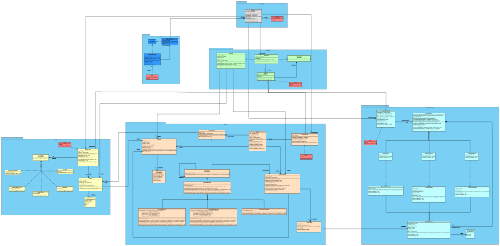

# Sistema de Información para Armería 🛡️

Este proyecto es un sistema de escritorio desarrollado y diseñado para gestionar inventario, clientes, ventas y permisos en una armería.

## 🚀 Características

- Registro de productos (armas, municiones, accesorios)
- Gestión de clientes con validación de permisos
- Facturación y control de ventas
- Módulo de inventario con alertas de stock
- Generación de reportes básicos

## 🧱 Tecnologías utilizadas

- Java 22.0.2 (OpenJDK)
- Maven
- IntelliJ IDEA / Visual Studio Code

## 🧩 Diagrama de Clases




## 🛠️ Instalación y ejecución

1. Clonar el repositorio:
   ```bash
   git clone https://github.com/Yordi1123/Sistema_Armeria_Aguila.git
